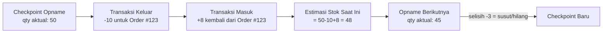
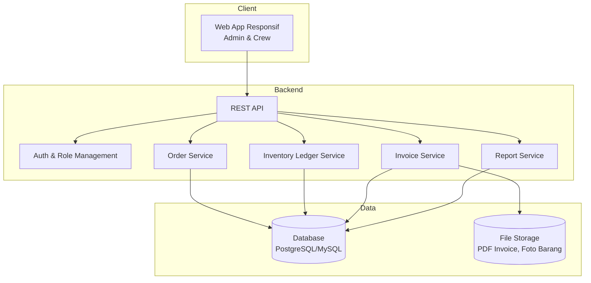
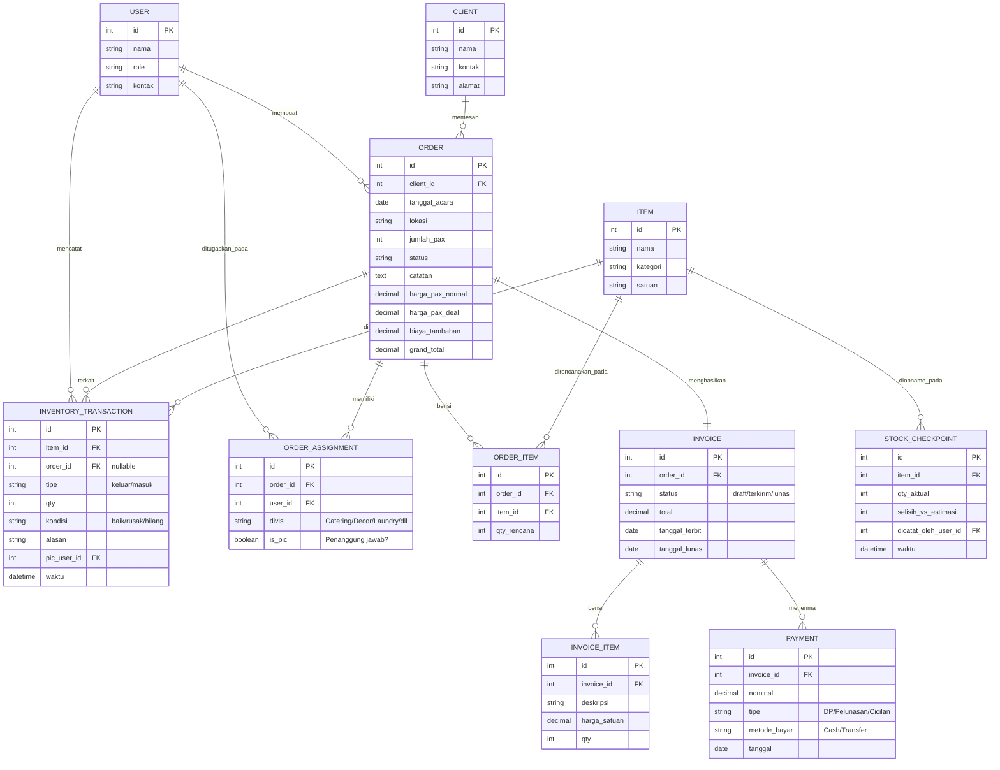
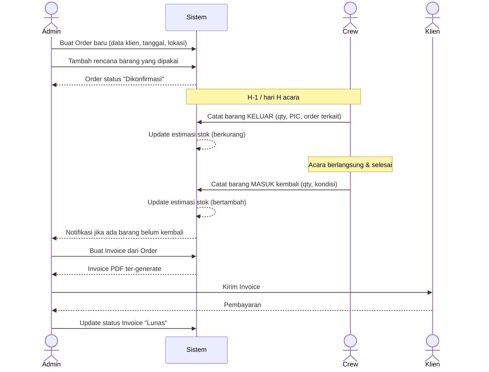
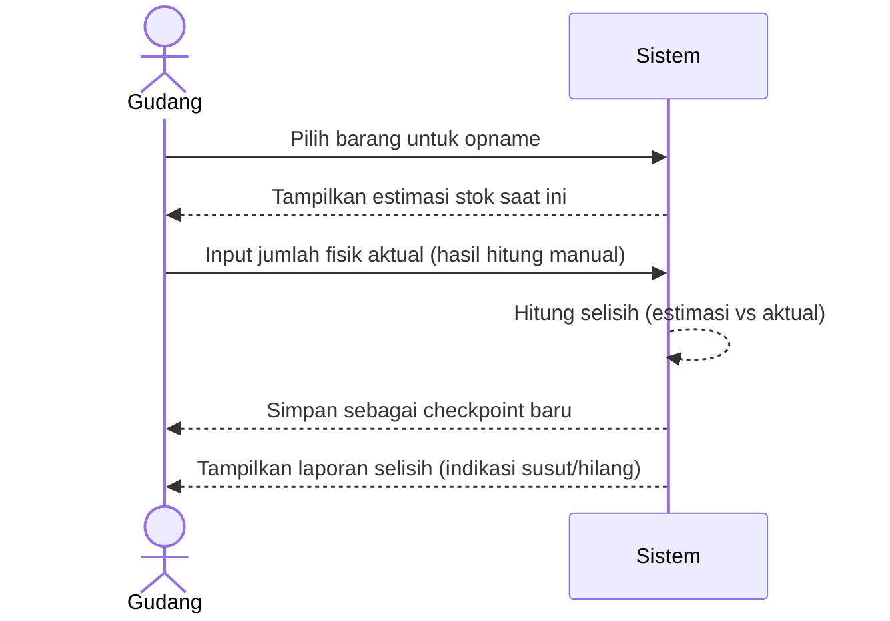

# Design Doc — Sistem Manajemen Catering
**Versi:** 0.1 (Draft)
**Terkait:** PRD-Sistem-Manajemen-Catering.md

---

## 1. Prinsip Desain Utama: Inventori Berbasis Ledger (Bukan Berbasis Stok Tetap)

Karena jumlah stok aktual tidak diketahui, sistem **tidak** dirancang seperti inventori retail biasa (stok = angka pasti yang dikurangi/tambah). Sebagai gantinya, dipakai pendekatan **ledger/log transaksi**:

- Setiap barang punya **riwayat transaksi** (keluar, masuk, opname).
- **Stok bukan angka master yang diedit langsung** — stok adalah **hasil hitung** dari: `checkpoint_terakhir + total_masuk − total_keluar` sejak checkpoint tersebut.
- **Stok opname** = checkpoint baru. Tidak menghapus histori lama, hanya menandai "per tanggal ini, jumlah fisik = X".
- Barang yang belum pernah di-opname tetap bisa dipakai dalam transaksi keluar/masuk — sistem hanya menampilkan estimasi dengan label "belum terverifikasi".

Pendekatan ini mirip prinsip *append-only ledger* pada sistem akuntansi: jangan pernah menimpa data lama, selalu tambah entri baru.



---

## 2. Arsitektur Sistem (High Level)



**Rekomendasi Tech Stack (sederhana, mudah dikelola tim kecil):**
- Frontend: web responsif (React/Next.js atau bisa lebih sederhana pakai Laravel Blade jika tim familiar PHP)
- Backend: Node.js (Express/NestJS) atau Laravel (PHP) — pilih sesuai keahlian tim
- Database: PostgreSQL atau MySQL
- File storage: lokal server dulu, bisa upgrade ke cloud storage (S3-compatible) belakangan
- Hosting: VPS sederhana cukup untuk skala 1 bisnis catering

*(Stack di atas rekomendasi, bisa disesuaikan dengan tim developer yang akan mengerjakan.)*

---

## 3. Data Model (ERD)



---

## 4. Alur Utama (Flow)

### 4.1 Alur Order → Invoice



### 4.2 Alur Stok Opname (Koreksi Berkala)



---

## 5. Rancangan Halaman (Screens)

| Halaman | Fungsi Utama | Peran Akses |
|---|---|---|
| Dashboard | Ringkasan order mendatang, barang belum kembali, invoice belum lunas | Admin |
| Daftar Order | List & filter order, buat order baru | Admin |
| Detail Order | Info order + daftar barang + penugasan kru (PIC & Divisi) + tombol buat invoice | Admin, Crew (view) |
| Input Barang Keluar/Masuk | Form cepat: pilih order, pilih barang, qty, kondisi | Crew, Admin |
| Master Barang & Stok | List semua barang + estimasi stok + status opname terakhir | Admin, Gudang |
| Stok Opname | Form input qty fisik aktual per barang | Gudang, Admin |
| Riwayat Transaksi Barang | Log lengkap keluar/masuk per barang | Admin, Gudang |
| Invoice | List invoice, buat/edit, export PDF, update status bayar | Admin |
| Laporan | Barang rawan hilang, rekap order per periode | Admin |

---

## 6. Contoh Endpoint API (Ringkas)

```
POST   /orders                     - buat order baru
GET    /orders/:id                 - detail order
PATCH  /orders/:id/status          - update status order

POST   /inventory/transactions     - catat barang keluar/masuk
GET    /inventory/items/:id/ledger - riwayat transaksi 1 barang
GET    /inventory/items/:id/stock  - estimasi stok berjalan

POST   /inventory/checkpoints      - input hasil stok opname
GET    /inventory/checkpoints/:item_id/history - riwayat opname

POST   /invoices                   - generate invoice dari order
PATCH  /invoices/:id/status        - update status pembayaran
GET    /invoices/:id/pdf           - export PDF
```

---

## 7. Pertimbangan Desain Tambahan

- **Input di lapangan harus cepat**: form catat barang keluar/masuk sebaiknya minim klik (pilih order aktif → pilih barang dari daftar favorit/sering dipakai → isi qty → simpan).
- **Tidak ada tombol "hapus" untuk transaksi lama** — kalau salah input, buat entri koreksi baru (tetap sesuai prinsip ledger di Bagian 1), supaya jejak audit tetap utuh.
- **Barang tanpa data stok awal tetap bisa dipakai** — sistem tidak boleh mem-block input hanya karena stok belum diketahui. Label "estimasi belum terverifikasi" cukup sebagai indikator visual.
- **Skalabilitas ke Fase 2**: struktur data payroll & pengeluaran (dari dokumen operasional) bisa jadi modul terpisah yang terhubung ke `USER` dan `ORDER` tanpa mengubah desain inventori di atas.

---

## 8. Rencana Implementasi Bertahap

1. **Sprint 1–2**: Master data (Item, Client, User/Role) + Modul Order dasar
2. **Sprint 3–4**: Modul Inventory Ledger (keluar/masuk) + estimasi stok
3. **Sprint 5**: Modul Stok Opname
4. **Sprint 6–7**: Modul Invoice + export PDF
5. **Sprint 8**: Dashboard & Laporan dasar
6. **Fase 2 (menyusul)**: Payroll, Pengeluaran Operasional, Notifikasi
