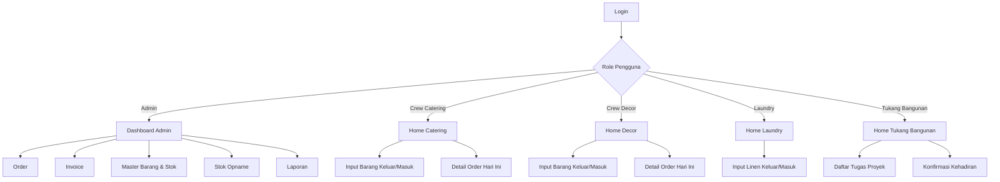

# UI Design Doc — Sistem Manajemen Catering
**Versi:** 0.1 (Draft)
**Terkait:** PRD-Sistem-Manajemen-Catering.md, Design-Doc-Sistem-Manajemen-Catering.md

---

## 1. Prinsip Desain

1. **Mobile-first untuk crew lapangan** (Catering, Decor, Laundry, Tukang Bangunan) — mereka mengakses sistem dari HP saat di lokasi acara/proyek, jadi form harus ringkas, tombol besar, minim ketikan (lebih banyak pilih dari daftar).
2. **Desktop-friendly untuk Admin** — butuh layar lebih lebar untuk kelola order, invoice, dan laporan sekaligus.
3. **Role-based home screen** — setiap divisi login dan langsung diarahkan ke halaman yang relevan dengan tugasnya, bukan menu umum yang membingungkan.
4. **Aksi utama selalu terlihat** — tombol seperti "Catat Barang Keluar" atau "Buat Invoice" tidak boleh tersembunyi di menu berlapis.
5. **Status visual jelas**: pakai badge warna (mis. Belum Lunas = merah, Lunas = hijau, Perlu Ditindaklanjuti = kuning) agar cepat dipindai mata.

---

## 2. Struktur Navigasi per Divisi



Setiap divisi punya **home screen berbeda** — tidak ada menu generik yang membuat crew bingung harus klik ke mana.

---

## 3. Wireframe: ADMIN

### 3.1 Dashboard Admin (Desktop)

```
┌─────────────────────────────────────────────────────────────────┐
│  ☰  Catering Manager           🔔 3   👤 Admin - Budi          │
├─────────────────────────────────────────────────────────────────┤
│  [Order]  [Invoice]  [Stok]  [Opname]  [Laporan]                │
├─────────────────────────────────────────────────────────────────┤
│  Ringkasan Hari Ini                                              │
│  ┌───────────────┐ ┌───────────────┐ ┌───────────────┐         │
│  │ Order Aktif   │ │ Invoice Belum │ │ Barang Belum  │         │
│  │      4        │ │ Lunas: 2      │ │ Kembali: 6    │         │
│  └───────────────┘ └───────────────┘ └───────────────┘         │
│                                                                   │
│  Order Mendatang                                                 │
│  ┌───────────────────────────────────────────────────────────┐ │
│  │ #123  Ulang Tahun Ibu Sari   28 Sep  200 pax   [Detail]    │ │
│  │ #124  Acara Kantor PT ABC    30 Sep  150 pax   [Detail]    │ │
│  └───────────────────────────────────────────────────────────┘ │
│                                                                   │
│  ⚠ Perlu Ditindaklanjuti                                         │
│  ┌───────────────────────────────────────────────────────────┐ │
│  │ Piring lebar - 12 pcs belum kembali (Order #120)           │ │
│  │ Kursi - 20 pcs belum kembali (Order #121)                  │ │
│  └───────────────────────────────────────────────────────────┘ │
└─────────────────────────────────────────────────────────────────┘
```

### 3.2 Detail Order (Admin)

```
┌─────────────────────────────────────────────────────────────────┐
│  ← Kembali          Order #123 - Ulang Tahun Ibu Sari            │
├─────────────────────────────────────────────────────────────────┤
│  Status: [Dikonfirmasi ▾]        Tanggal: 28 Sep 2026            │
│  Klien: Ibu Sari  |  0812xxxxxxx  |  Jl. Melati No. 5            │
│  Pax: 200          Paket: Prasmanan Premium                      │
├─────────────────────────────────────────────────────────────────┤
│  Barang Direncanakan                          [+ Tambah Barang]  │
│  ┌───────────────────────────────────────────────────────────┐ │
│  │ Piring lebar        200 pcs      Keluar: 200   Masuk: 0    │ │
│  │ Meja bundar         20 pcs       Keluar: 20    Masuk: 0    │ │
│  │ Kursi               200 pcs      Keluar: 200   Masuk: 0    │ │
│  └───────────────────────────────────────────────────────────┘ │
├─────────────────────────────────────────────────────────────────┤
│                                    [Buat Invoice]  [Batalkan]     │
└─────────────────────────────────────────────────────────────────┘
```

### 3.3 Master Barang & Stok

```
┌─────────────────────────────────────────────────────────────────┐
│  Master Barang & Stok                    [+ Tambah Barang Baru]  │
├─────────────────────────────────────────────────────────────────┤
│  🔍 Cari barang...                     Kategori: [Semua ▾]       │
├─────────────────────────────────────────────────────────────────┤
│  Nama            Kategori   Estimasi Stok   Status Opname        │
│  ───────────────────────────────────────────────────────────    │
│  Piring lebar     Catering    ~480 pcs      ✅ 12 Sep 2026        │
│  Meja bundar      Decor       ~35 unit      ⚠ Belum pernah       │
│  Taplak meja      Laundry     ~60 pcs       ✅ 20 Sep 2026        │
│  Kursi            Decor       ~250 unit     ⚠ Belum pernah       │
│                                                                   │
│  [klik nama barang → riwayat transaksi lengkap]                  │
└─────────────────────────────────────────────────────────────────┘
```

### 3.4 Invoice

```
┌─────────────────────────────────────────────────────────────────┐
│  Invoice #INV-0056                        Status: [Belum Lunas ▾]│
├─────────────────────────────────────────────────────────────────┤
│  Untuk Order #123 - Ibu Sari                                     │
│                                                                   │
│  Deskripsi                      Qty     Harga        Subtotal    │
│  ─────────────────────────────────────────────────────────────  │
│  Paket Prasmanan Premium        200     Rp 75.000    Rp15.000.000│
│  Sewa Meja & Kursi Decor        1       Rp 1.500.000 Rp 1.500.000│
│                                                        + Tambah   │
│  ─────────────────────────────────────────────────────────────  │
│                                          Total: Rp16.500.000      │
├─────────────────────────────────────────────────────────────────┤
│              [Simpan Draft]  [Kirim ke Klien]  [Export PDF]      │
└─────────────────────────────────────────────────────────────────┘
```

---

## 4. Wireframe: CREW CATERING (Mobile)

```
┌───────────────────────┐   ┌───────────────────────┐
│  Home - Crew Catering │   │  Catat Barang Keluar   │
├───────────────────────┤   ├───────────────────────┤
│ 👤 Andi                │   │ Order:                 │
│                        │   │ [#123 - Ibu Sari    ▾] │
│ Order Hari Ini:        │   │                        │
│ ┌────────────────────┐│   │ Barang:                │
│ │ #123 Ibu Sari       ││   │ [Piring lebar       ▾] │
│ │ 28 Sep - 200 pax    ││   │                        │
│ │        [Lihat]      ││   │ Qty:  [  200  ]        │
│ └────────────────────┘│   │                        │
│                        │   │ PIC: Andi (otomatis)   │
│ [📤 Catat Barang       │   │                        │
│     Keluar]            │   │     [Simpan]           │
│                        │   └───────────────────────┘
│ [📥 Catat Barang       │
│     Masuk/Kembali]     │   ┌───────────────────────┐
│                        │   │ Catat Barang Masuk     │
│ [📋 Riwayat Saya]      │   ├───────────────────────┤
└───────────────────────┘   │ Order: [#123        ▾] │
                             │ Barang: [Piring lebar▾]│
                             │ Qty kembali: [ 195  ]  │
                             │ Kondisi:               │
                             │ (•) Baik  ( ) Rusak    │
                             │ Catatan (opsional):     │
                             │ [___________________]  │
                             │      [Simpan]           │
                             └───────────────────────┘
```

**Catatan:** Crew Catering hanya melihat order yang relevan dengan tugasnya (bahan makanan, alat masak, alat saji). Dropdown barang otomatis difilter ke kategori "Catering".

---

## 5. Wireframe: CREW DECOR (Mobile)

```
┌───────────────────────┐   ┌───────────────────────┐
│  Home - Crew Decor    │   │  Catat Barang Keluar   │
├───────────────────────┤   ├───────────────────────┤
│ 👤 Rian                │   │ Order: [#123        ▾] │
│                        │   │ Barang: [Meja bundar▾] │
│ Order Hari Ini:        │   │ Qty:   [   20   ]      │
│ ┌────────────────────┐│   │ PIC: Rian (otomatis)   │
│ │ #123 Ibu Sari       ││   │      [Simpan]           │
│ │ 28 Sep - Dekor      ││   └───────────────────────┘
│ │ Panggung + Meja Kursi│
│ │        [Lihat]      ││   ┌───────────────────────┐
│ └────────────────────┘│   │ Lapor Barang Rusak     │
│                        │   ├───────────────────────┤
│ [📤 Catat Barang       │   │ Barang: [Kursi       ▾]│
│     Keluar]            │   │ Qty rusak: [   3   ]   │
│                        │   │                        │
│ [📥 Catat Barang       │   │ Catatan:               │
│     Masuk/Kembali]     │   │ [Kaki patah saat bongkar]│
│                        │   │      [Kirim Laporan]   │
│ [⚠ Lapor Barang Rusak] │   └───────────────────────┘
└───────────────────────┘
```

**Catatan:** Decor punya kategori barang berbeda (meja, kursi, panggung, dekorasi) dan fitur tambahan **Lapor Barang Rusak** karena risiko kerusakan alat besar (meja/kursi/panggung) lebih tinggi di divisi ini.

---

## 6. Wireframe: LAUNDRY (Mobile)

```
┌───────────────────────┐   ┌───────────────────────┐
│  Home - Laundry       │   │  Catat Linen Keluar    │
├───────────────────────┤   ├───────────────────────┤
│ 👤 Sinta               │   │ Order: [#123        ▾] │
│                        │   │ Barang: [Taplak meja▾] │
│ Linen Kotor Masuk      │   │ Qty:   [   20   ]      │
│ Hari Ini: 3 Order      │   │      [Simpan]           │
│                        │   └───────────────────────┘
│ [📥 Terima Linen       │
│     Kotor dari Acara]  │   ┌───────────────────────┐
│                        │   │ Linen Siap Dipakai     │
│ [📤 Serahkan Linen     │   │ (Update Stok Bersih)   │
│     Bersih]            │   ├───────────────────────┤
│                        │   │ Barang: [Taplak meja▾] │
│ [📋 Riwayat Cucian]    │   │ Qty bersih:  [ 18 ]    │
└───────────────────────┘   │ Rusak/tidak layak: [2] │
                             │      [Simpan]           │
                             └───────────────────────┘
```

**Catatan:** Alur laundry sedikit beda — ada 2 tahap: (1) terima linen kotor dari acara (masuk ke laundry), (2) linen bersih siap pakai (keluar dari laundry, masuk lagi ke stok gudang utama). Ini tetap pakai modul ledger yang sama, hanya beda label & kategori.

---

## 7. Wireframe: TUKANG BANGUNAN (Mobile)

```
┌───────────────────────┐   ┌───────────────────────┐
│  Home - Tukang Bangunan│  │  Konfirmasi Kehadiran  │
├───────────────────────┤   ├───────────────────────┤
│ 👤 Wahyu (Freelance)   │   │ Tanggal: 26 Sep 2026   │
│                        │   │ Jam Datang: [ 07:05 ]  │
│ Tugas Hari Ini:        │   │ Jam Pulang: [   -   ]  │
│ ┌────────────────────┐│   │                        │
│ │ Perbaikan atap      ││   │      [Check-in]        │
│ │ gudang belakang     ││   └───────────────────────┘
│ │        [Lihat]      ││
│ └────────────────────┘│   ┌───────────────────────┐
│                        │   │ Laporan Progress       │
│ [✅ Konfirmasi         │   ├───────────────────────┤
│    Kehadiran]          │   │ Tugas: [Perbaikan atap▾]│
│                        │   │ Progress: [====  60%]  │
│ [📝 Laporan Progress   │   │                        │
│    Pekerjaan]          │   │ Catatan:               │
│                        │   │ [_________________]    │
└───────────────────────┘   │      [Kirim]            │
                             └───────────────────────┘
```

**Catatan:** Tukang Bangunan **tidak terlibat langsung** dengan modul inventori peralatan catering (fokus mereka proyek fisik/renovasi, bukan alat saji). Sesuai PRD Fase 2, touchpoint mereka di sistem cukup ringan: konfirmasi kehadiran (untuk dasar hitung gaji harian/lembur) dan laporan progress tugas — bukan transaksi barang seperti 4 divisi lain.

---

## 8. Komponen UI yang Dipakai Berulang (Reusable)

| Komponen | Dipakai di | Deskripsi |
|---|---|---|
| **Card Order Ringkas** | Admin Dashboard, Home Catering/Decor | Nama klien, tanggal, pax, tombol Lihat |
| **Dropdown Barang (terfilter kategori)** | Semua form input keluar/masuk | Otomatis filter sesuai divisi (Catering/Decor/Laundry) |
| **Badge Status** | Order, Invoice, Stok | Warna: Hijau=Selesai/Lunas, Kuning=Proses, Merah=Perlu Perhatian |
| **Riwayat/Log Transaksi** | Semua divisi (versi masing-masing) | List kronologis: siapa, kapan, apa, untuk order apa |

---

## 9. Tone Visual & Aksesibilitas

- **Warna dasar**: netral (putih/abu muda) dengan aksen warna per status (hijau/kuning/merah) — bukan dekoratif, fungsional untuk memindai cepat.
- **Ukuran tombol besar** di versi mobile (min. 44x44px area sentuh) karena crew lapangan sering input sambil berdiri/terburu-buru.
- **Font besar & jelas** — hindari teks kecil di form lapangan, prioritaskan keterbacaan di bawah sinar matahari (outdoor event).
- **Minim langkah**: target maksimal 3 tap untuk menyelesaikan 1 transaksi keluar/masuk barang dari home screen.

---

## 10. Ringkasan Cakupan Divisi

| Divisi | Modul Utama di UI | Fase |
|---|---|---|
| **Admin** | Dashboard, Order, Invoice, Master Barang & Stok, Opname, Laporan | Fase 1 |
| **Crew Catering** | Home order harian, Input barang keluar/masuk (kategori catering) | Fase 1 |
| **Crew Decor** | Home order harian, Input barang keluar/masuk (kategori decor), Lapor rusak | Fase 1 |
| **Laundry** | Terima linen kotor, Serahkan linen bersih, Riwayat cucian | Fase 1 |
| **Tukang Bangunan** | Konfirmasi kehadiran, Laporan progress tugas | Fase 2 (ringan, terhubung ke payroll) |
