# Rancangan Pengembangan Sistem ERP (HR, Operasional & Rental)

Dokumen ini merangkum rancangan struktur *database* dan arsitektur sistem baru untuk mengakomodasi kebutuhan manajemen divisi, absensi geofencing, sistem penggajian dinamis, kasbon, pengeluaran, utang vendor, dan skenario penyewaan alat murni.

## 1. Diagram Entity-Relationship (ERD)

```mermaid
erDiagram
    USERS ||--o| EMPLOYEE_PROFILES : "has"
    USERS ||--o{ ATTENDANCES : "records"
    USERS ||--o{ CASH_ADVANCES : "borrows"
    USERS ||--o{ PAYROLLS : "receives"
    
    PAYROLLS ||--o{ CASH_ADVANCE_PAYMENTS : "deducts"
    CASH_ADVANCES ||--o{ CASH_ADVANCE_PAYMENTS : "paid via"
    
    ORDERS ||--o{ ORDER_ITEMS : "contains"
    ORDER_ITEMS }|--|| ITEMS : "refers to"
    
    VENDOR_TRANSACTIONS }|--|| VENDORS : "bills from"
    
    USERS {
        int id PK
        string name
        string role "admin, crew_decor, crew_catering, laundry, tukang_bangunan"
        string email
    }
    
    EMPLOYEE_PROFILES {
        int id PK
        int user_id FK
        string employment_type "Tetap, Freelance, Panggilan"
        decimal daily_base_salary "Gaji pokok harian tetap"
    }

    ATTENDANCES {
        int id PK
        int user_id FK
        date tanggal
        time clock_in_time
        string clock_in_lat "Geofencing Latitude"
        string clock_in_lng "Geofencing Longitude"
        time clock_out_time
        int late_minutes
        string status "Hadir, Sakit, Izin, Alpa"
    }

    CASH_ADVANCES {
        int id PK
        int user_id FK
        decimal total_amount "Total kasbon awal"
        decimal remaining_balance "Sisa utang kasbon"
        date tanggal
        string keterangan
        string status "Unpaid, Partial, Paid"
    }

    CASH_ADVANCE_PAYMENTS {
        int id PK
        int payroll_id FK
        int cash_advance_id FK
        decimal amount "Nominal yang dipotong pada gaji ini"
    }

    PAYROLLS {
        int id PK
        int user_id FK
        date period_start
        date period_end
        decimal base_salary "Total gaji pokok"
        decimal total_allowance "Lembur, Piket, Bonus Visit"
        decimal total_deduction "Denda telat, Potongan Kasbon"
        decimal net_salary "Gaji bersih"
        string status "Draft, Paid"
    }

    EXPENSES {
        int id PK
        string category "catering_materials, decor_operational, salary, utilities"
        decimal amount
        date tanggal
        string notes "Input manual"
        int recorded_by FK "User yg input"
    }

    ITEMS {
        int id PK
        string name
        string type "package, consumable, rental_equipment"
    }

    ORDER_ITEMS {
        int id PK
        int order_id FK
        int item_id FK
        int qty
        decimal price
        datetime rental_start_date "Khusus barang rental"
        datetime rental_end_date "Khusus barang rental"
        string return_status "dipinjam, dikembalikan, rusak"
    }

    VENDORS {
        int id PK
        string name
        string contact
    }

    VENDOR_TRANSACTIONS {
        int id PK
        int vendor_id FK
        decimal total_amount
        decimal paid_amount
        string status "Unpaid, Partial, Paid"
        string notes
    }
```

---

## 2. Rincian Pembaruan Modul

### A. Modul Karyawan & Absensi
*   **Tabel `employee_profiles` (Baru):** Menangani tipe pekerja (freelance vs tetap) dan menyimpan `daily_base_salary` (Gaji yang sudah dinegosiasikan / ditetapkan di awal untuk Tukang & Decor).
*   **Tabel `attendances` (Baru):** 
    *   Wajib mengirimkan koordinat (Lat/Lng) saat aksi *Clock In*.
    *   *Service layer* akan menghitung secara otomatis `late_minutes` berdasarkan jadwal shift (`role` user) dan mencatat denda keterlambatan (Rp 5.000 / 30 menit) yang nantinya diteruskan ke sistem Payroll.

### B. Modul Keuangan Ekstra (Pengeluaran & Hutang)
*   **Kasbon (`cash_advances` & `cash_advance_payments`):**
    *   Jika karyawan meminjam uang, akan tercatat di tabel `cash_advances` dengan `total_amount` dan `remaining_balance`.
    *   **Pembayaran Fleksibel (Cicilan):** Saat Admin membuat Payroll, Admin bisa menginput nominal potongan kasbon secara manual sesuai kesanggupan karyawan (misal: Kasbon 1 juta, bulan ini dipotong 200rb).
    *   Potongan tersebut disimpan di `cash_advance_payments` dan otomatis mengurangi `remaining_balance`. Jika sisa saldo mencapai 0, status berubah menjadi `Paid`.
*   **Pengeluaran Operasional (`expenses`):** Modul sederhana untuk pengeluaran uang tunai yang tidak masuk stok inventaris (seperti beli bahan baku catering di pasar, rokok/bensin decor, bayar listrik bulanan).
*   **Hutang Vendor (`vendor_transactions`):** Pencatatan khusus untuk melacak tagihan dari pihak ketiga (misal: vendor bunga/tenda) yang belum dibayar lunas oleh perusahaan.

### C. Modul Penyewaan Alat Saja (Equipment Rental)
*   **Update `items`:** Penambahan kolom `type` untuk membedakan mana yang layanan jasa/paket, mana bahan habis pakai, dan mana **alat yang disewakan**.
*   **Update `order_items`:** 
    *   Penambahan `rental_start_date` dan `rental_end_date`.
    *   Penambahan `return_status` untuk membantu staf gudang/logistik memonitor barang mana saja yang sedang di tangan Klien dan belum dikembalikan. Klien yang hanya murni menyewa alat akan menggunakan *flow* pesanan ini tanpa perlu *assign* kru dapur.

---

## 3. Langkah Implementasi Selanjutnya
Dokumen arsitektur ini sudah siap diubah menjadi baris kode. Implementasi akan dilakukan dengan tahapan:
1.  Pembuatan *Migration* & *Model* untuk masing-masing tabel di atas.
2.  Pengaturan relasi (Eloquent Relationships) di tiap Model.
3.  Pembuatan *Service Class* (misal: `PayrollService.php`, `AttendanceService.php`) untuk menjaga logika bisnis tetap modular dan terpisah dari *Controller*.
